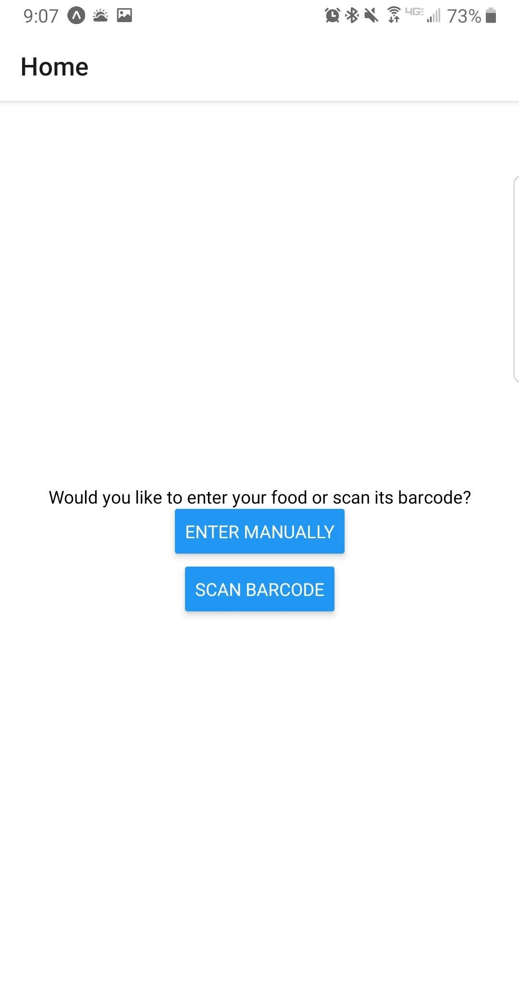
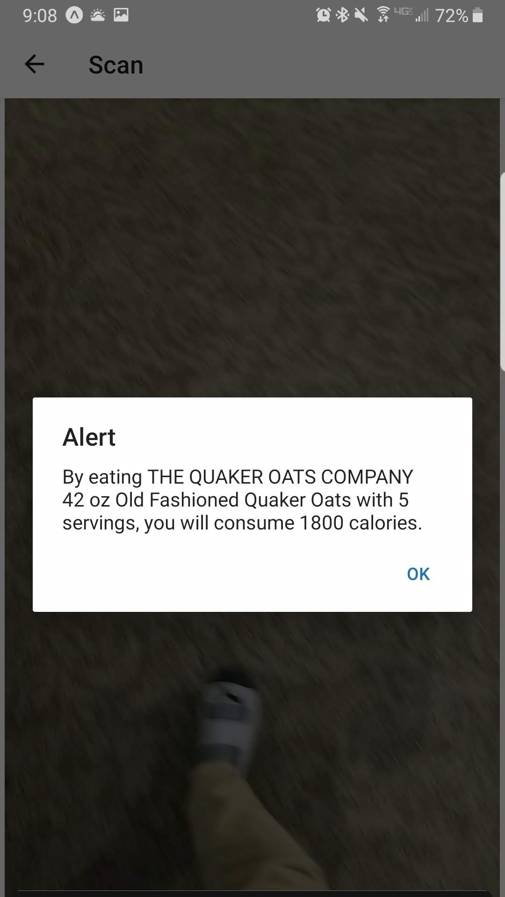
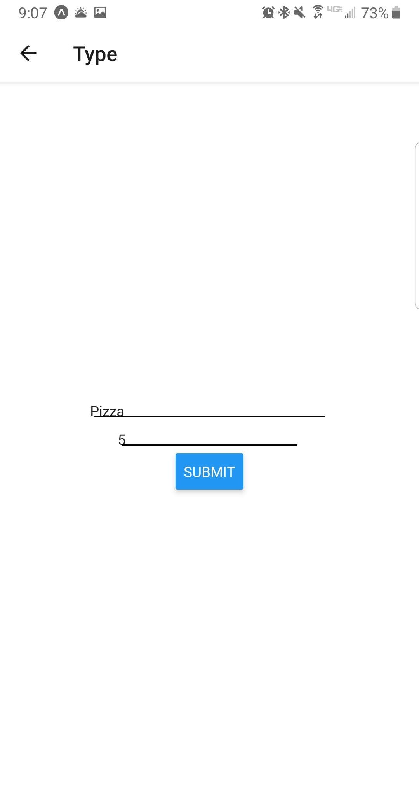
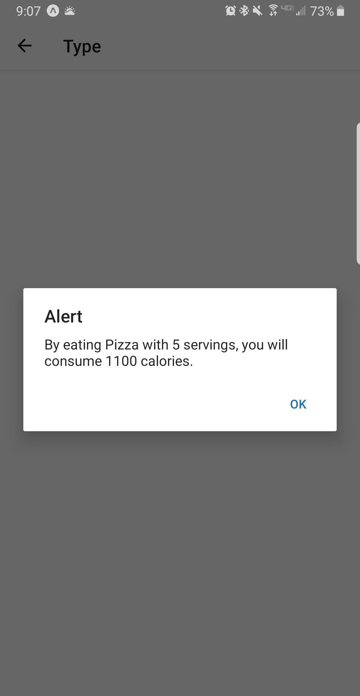
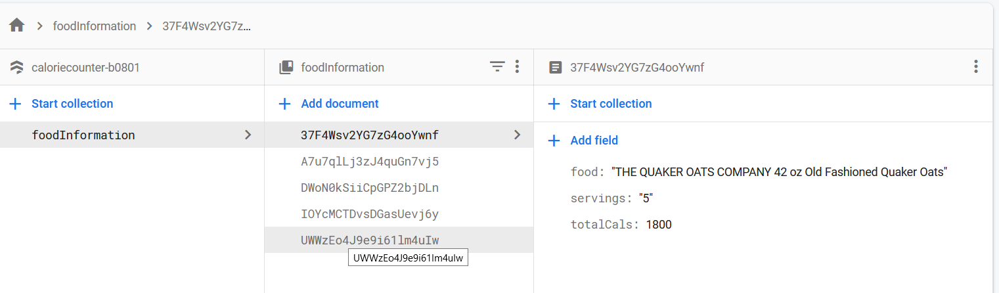
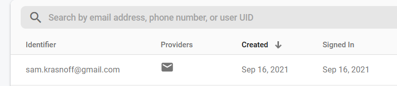

# The Calorie Counter App

 

  

## A brief timeline of the app
 - September 7-10, the focus was mainly on setting up expo properly and having initial dependencies and packages installed.
 - Sep 10-12, creating a function barcode scanner and learning the FDA API
 - Sep 12-13, connecting all the APIs and completing a rough draft
- Sep 13-15, Adding firebase/database support and reconfiguring the app slightly for ease of use.
- Sep 15-17, Cleaning up the app, adding authentication, creating this Markdown file for easy digestion of information.

## - Barcode Scanner
 - The first part added was the barcode scanner package. Due to issues with the <i> react-native-camera </i> package, we used one called <i> expo-barcode-scanner </i>. This simply gave the type and data of the barcode. 
 - This information was not sufficient for the FDA API to give caloric information, so a HTTP GET request of a UPC (universal product code/barcode) API was made, and the name of the product was captured. 
  - Following this request, a second GET request is made to the API with the product as the search query. Various information including the caloric content of one serving is returned. The total calories are calculated and shown with the number of servings input by the user.

 
  

  

  ## - Manual Input
   - The app includes another option to manually enter the food the user wants to eat, along with the number of servings. This will be processed by the FDA API only, and return caloric information to the user. 

  

 
  

  

# Firebase

 ## - Firestore
  - To store content, we used Firestore, a database utility of Firebase. By installing the Firebase package and configuring with the proper keys and ENV variables, it was just a few lines to store information from each user request. Below is an example of a call that may have been made to store the information

  `
  dbh.collection('foodInformation').add({food: food, servings: servings, totalCals: foodInfo*servings})
  `

## - Authentication
 - To allow users to sign in, we used the Firebase auth package to simply authenticate an email and password that could be stored in our Firebase project. 
 - An example line would look something like `auth.signInwith EmailAndPassword(email,password)`, so most of the heavy lifting can be transferred to the API. 

## A few pictures of the backend to round it off

